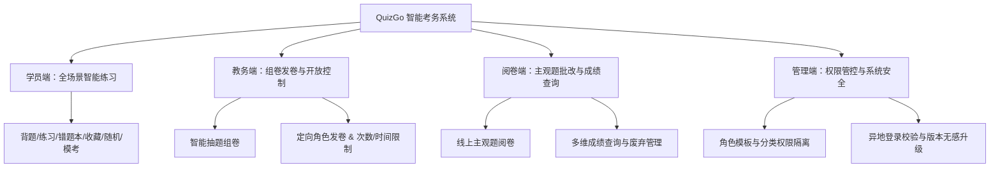

# 🚀 QuizGo 在线考试与智能培训系统产品白皮书

> **为企业、高校与培训机构打造的一站式数字教务、智能组卷与精准考务解决方案**

---

## 📌 一、 系统概述（Executive Summary）

在数字化转型与高效教务管理的浪潮下，**QuizGo** 是一款面向企业内部培训、学校教务考核及职业认证培训打造的**企业级移动端在线考试与智能练习平台**。

系统基于现代化的 Android Jetpack Compose 架构与 Supabase 高可用云端原生支撑，融合了**全场景智能练习、自动化抽题组卷、定向发卷控制、主观题线上阅卷、多维成绩分析与精细化数据隔离**等核心能力，帮助组织大幅提升考核效率、保障考务安全，实现全流程无纸化、数字化的高效考务管理。

---

## 🌟 二、 核心特色与优势（Key Highlights）

> [!TIP]
> **全场景覆盖**：从学员每日刷题巩固、模拟测评，到教务人员智能组卷、定向发卷，再到老师线上批改与成绩分析，提供闭环式一站式体验。

| 维 度 | 传统考务模式 | QuizGo 数字化考务平台 |
| :--- | :--- | :--- |
| **组卷效率** | 手工找题拼卷，耗时耗力且容易错漏 | 智能按题型、分值与分类秒级随机抽题组卷 |
| **考核控制** | 无法精准控制考试对象与考试次数 | 支持按角色定向发卷、开放时间区间及限制考试次数 |
| **阅卷与成绩** | 纸质阅卷繁琐，成绩统计漫长 | 客观题自动秒批，主观题线上协同批改，多维报表实时生成 |
| **数据安全** | 试卷资产易泄漏，教师之间缺乏数据隔离 | 严格的角色数据隔离，非管理员仅能管理本账号资产 |

---

## 💡 三、 核心功能模块白皮书（Product Features）

### 1. 🎓 学员端：全场景智能练习与考试体系
* **多样化练习模式**：
  * **背题模式**：直接呈现正确答案与详细解析，适合快速冲刺记忆。
  * **普通练习/随机练习**：支持按题库分类刷题，实时反馈答题正确率。
  * **错题本与收藏夹**：自动归集错题，支持精准重温与考点巩固。
* **正式考试与答题还原**：
  * **全真模拟/正式考试**：沉浸式卡片化答题界面，支持滑动切换、卡片进度检索。
  * **100% 原始顺序还原**：回溯考试记录时，题目出现顺序与学员实际考试时的顺序**完全一致**。
  * **考试次数与时段限制**：严格遵从教务设定的“每日开放时段”与“最大允许考试次数”，超额自动拦截保护。

---

### 2. 📝 教务端：智能组卷与定向发卷控制
* **智能随机抽题组卷**：
  * 自由设定试卷名称、考试时长、及格分与总分。
  * 按单选、多选、判断、填空、简答等题型分别设置抽题数量与分值，秒级生成试卷资产。
  * **编辑试卷可视化面板**：直观展示题库类型、总题量及各题型的分值构成细则（如：`单选题 (10题) 共50分`）。
* **定向发卷与权限绑定**：
  * **定向发布对象**：支持发布给特定角色（如：`教师`、`学员`），防止角色越权溢出。
  * **开放时间区间与时段**：灵活配置考试有效日期（如 `2026-01-01 至 2026-12-31`）与每日开放时段（如 `08:00 - 22:00`）。
  * **限制考试次数**：支持设定学员允许参加的最大次数（如限制 `1` 次或 `0` 为不限）。

---

### 3. 📊 阅卷端：线上主观题批改与成绩分析
* **主观题线上协同批改**：
  * 针对填空题与简答题，老师可在线调阅学员提交的答卷进行打分，系统自动折算最终总分。
  * 支持单独“废弃答卷”，方便清理学员空白卷或无效答卷。
* **多维成绩查询与数据控制**：
  * 实时汇总正式考试记录，展示总记录数、平均分与及格率。
  * 支持按试卷名称筛选、姓名/邮箱搜索，以及“最新时间/成绩最高/成绩最低”多维排序。
  * 支持单独删除废弃异常成绩；撤发试卷时支持选择是否同步清空学员记录。

---

### 4. 🛡️ 管理端：数据隔离与系统安全保障
* **严格的数据权限隔离**：
  * **组卷权限控制**：非管理员账号在组卷时，仅能在管理员配置授权的“抽题题库分类”与“目标角色”范围内操作。
  * **试卷与考绩隔离**：非管理员在发卷与成绩查询中，**仅能展示与管理本账号创制/发布的试卷及成绩**，彻底隔离跨账号数据。
* **系统安全与版本无感升级**：
  * **异地登录抢占校验（Session Kickout）**：检测到账号在其他设备登录时，自动提醒并安全退回登录页。
  * **冷启动无感版本检测**：软件打开时自动静默对比版本，发现新版本时平滑弹窗提示更新。

---

## 🔒 四、 技术架构与安全保障（Architecture & Security）

> [!IMPORTANT]
> **QuizGo 采用前沿的企业级技术栈，确保高并发下的稳定性与数据安全性。**

* **前端UI**：基于 **Android Jetpack Compose** 构建，全响应式状态管理，具备 60fps 流畅手势与 3D 缩放交互反馈。
* **云端支撑**：基于 **Supabase PostgreSQL** 高可用服务，结合基于 JWT 的 **Row Level Security (RLS)** 行级安全策略，实现底层数据安全隔离。
* **数据柔性反序列化**：内置 `FlexibleStringListSerializer` 柔性解析器，兼容多种 JSON 与数据库数组格式，保障复杂网络环境下的数据稳定读取。

---

## 📢 五、 结语与未来展望（Conclusion & Roadmap）

**QuizGo** 致力于用技术赋能教务管理，让考核更简单、让学习更高效！

未来，我们将继续推出 **防作弊切屏监控、高频错题分析榜单以及电子证书颁发** 等更多企业级高级特性。

---

> 欢迎关注，如有企业定制或系统部署需求，欢迎在后台留言咨询。
